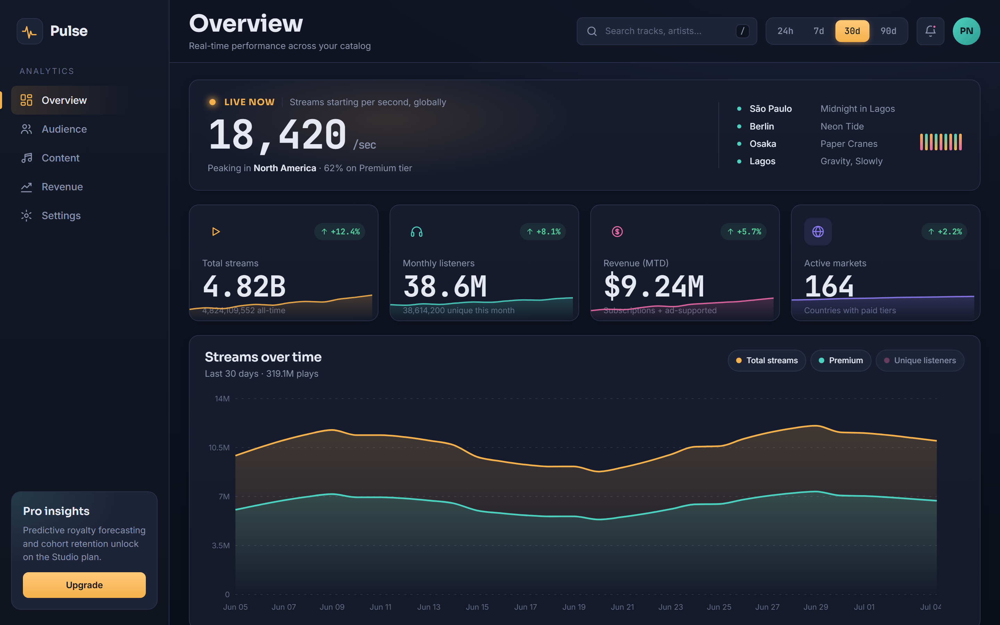

# Pulse · Streaming Analytics Dashboard

> A real-time analytics dashboard for a music-streaming platform — track streams, listeners, revenue and audience geography at a glance.

**Portfolio project.** Built to demonstrate production-grade React + TypeScript, thoughtful data visualization, and a distinctive, non-templated UI.



---

## Tech stack

- **React 18** + **TypeScript** (strict mode)
- **Vite** for dev server & build
- **Recharts** for the area / bar / donut charts
- **Plain CSS** — CSS Modules per component + a design-token layer in `src/index.css` (no Tailwind, no UI kit)
- **Zero icon dependency** — all icons are hand-authored inline SVG components

## Features

- **Five fully realised sections**, each with its own content — not just a title swap:
  - **Overview** — live pulse, KPIs, streams-over-time area chart, top tracks, geography, tracks table.
  - **Audience** — listener KPIs, top-artist leaderboard, geography donut, age distribution and device split.
  - **Content** — catalogue KPIs, top-tracks bar chart, artist leaderboard and the full tracks table.
  - **Revenue** — revenue KPIs, a stacked subscriptions-vs-ads bar chart, revenue by source, and an artist payouts table with status badges.
  - **Settings** — a working workspace form (name, timezone, currency) and notification switches.
- **Live Pulse panel** — the signature hero: streams-per-second updating in real time with a gently pulsing indicator and an animated equalizer. Fully honors `prefers-reduced-motion`.
- **Interactive time-series** — area chart of streams / premium / unique listeners with toggleable series and a date-range switch (24h / 7d / 30d / 90d).
- **KPI stat cards** with embedded sparklines and period-over-period deltas.
- **Sortable track leaderboard** — click any column header to re-sort; inline SVG sparklines per row.
- **Responsive** from ultrawide down to mobile: the sidebar collapses to a hamburger drawer and every grid reflows to a single column.
- **Accessible** — semantic HTML, visible keyboard focus rings, `aria-label`s on icon-only buttons, `aria-sort` on table headers, and a polite live region on the ticker.

## Getting started

```bash
npm install
npm run dev
```

Then open the URL Vite prints (default http://localhost:5173).

Other scripts:

```bash
npm run build     # type-check + production build to /dist
npm run preview   # preview the production build
```

## Design notes

The look deliberately avoids the generic "near-black + single acid-green accent" dashboard cliché. The canvas is a **deep indigo** with a subtle vertical gradient, layered over two **warm accents** — amber (`#F5B14C`) as primary and teal (`#4CD0C0`) as secondary — plus a soft **magenta** (`#E86AA6`) reserved for the third chart series, so every color carries meaning rather than decoration.

Typography uses a three-family scale loaded from Google Fonts: **Sora** for display headings, **Inter** for body copy, and **JetBrains Mono** for every metric and table figure, which keeps large numbers crisp and tabular. The signature moment is the **Live Pulse** panel: instead of yet another big-number-with-sparkline, it simulates real streaming activity with a `setInterval`-driven ticker (via the `useLivePulse` hook) that drifts realistically toward a baseline — and goes completely still when the user prefers reduced motion.

## Project structure

```
src/
  components/     Sidebar, TopBar, StatCard, LivePulse, StreamsChart,
                  TopTracksChart, GeographyChart, TracksTable, Panel,
                  Sparkline, ChartTooltip, icons
  views/          OverviewView, AudienceView, ContentView, RevenueView, SettingsView
  hooks/          useLivePulse, usePrefersReducedMotion
  data/           mock dashboard data (typed) + shared types
  utils/          number formatting helpers
  App.tsx         section routing + layout composition
  index.css       design tokens + base styles
```

---

_Mock data only — no backend. All artist, track and city names are invented for the demo._
